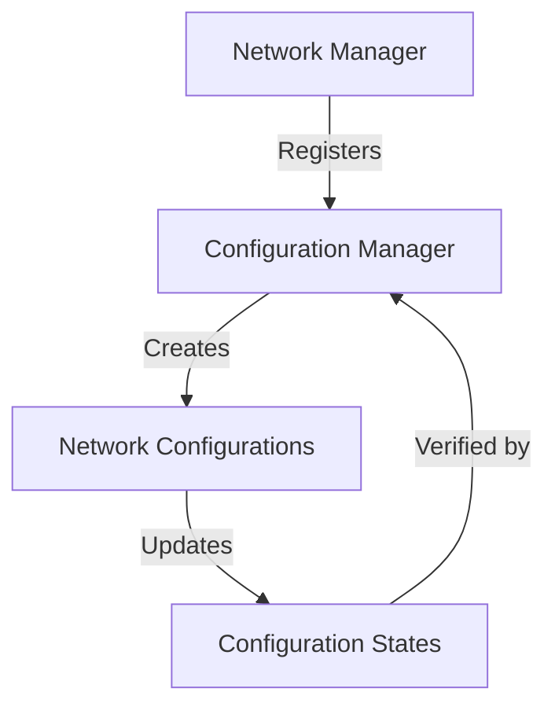

# Configure State

A blockchain-based system for secure, decentralized network configuration management using the Stacks blockchain. This solution provides organizations with immutable and verifiable state management for distributed network configurations.

## Overview

The Configure State project creates a tamper-proof registry for network configurations by storing cryptographically secure state information on the Stacks blockchain. It addresses critical needs in network and IoT configuration management:

- Secure configuration tracking
- Immutable configuration history
- Centralized configuration management
- Verifiable network state changes

Key features:
- Network configuration manager registration
- Configuration creation and update
- Immutable configuration tracking
- Timestamped configuration versioning

## Architecture

The system consists of a single smart contract that manages network configuration registration and state tracking. The architecture follows a centralized management model where:

1. Each network has a configuration manager
2. Multiple configurations can be registered per manager
3. Configuration states are tracked with cryptographic integrity



## Contract Documentation

### configuration-manager

The main contract handling network configuration management.

#### Data Storage
- `network-managers`: Maps owner principals to configuration manager information
- `network-configurations`: Stores registered network configurations
- `manager-configurations`: Tracks configurations registered to each manager

#### Access Control
- Only registered network configuration managers can create and update configurations
- Each configuration can be created once per manager
- Configurations are immutable after initial creation

## Getting Started

### Prerequisites
- Clarinet
- Stacks wallet
- Network configuration management strategy

### Installation

1. Clone the repository
2. Install dependencies with Clarinet
```bash
clarinet integrate
```

### Basic Usage

1. Register your Network Configuration Manager:
```clarity
(contract-call? .configuration-manager register-network-manager "your-manager-id")
```

2. Create a network configuration:
```clarity
(contract-call? .configuration-manager create-network-configuration 
    "config-01" "Production Network" "network-config" "{'key1':'value1','key2':'value2'}")
```

3. Update a network configuration:
```clarity
(contract-call? .configuration-manager update-network-configuration 
    "config-01" "{'key1':'new-value1','key2':'new-value2'}")
```

## Function Reference

### Registration Functions

```clarity
(register-network-manager (manager-id (string-ascii 64)))
```
Registers a new network configuration manager.

```clarity
(create-network-configuration 
    (config-id (string-ascii 64)) 
    (config-name (string-ascii 64)) 
    (config-type (string-ascii 32)) 
    (config-data (string-ascii 256)))
```
Creates a new network configuration for the manager.

### Update Functions

```clarity
(update-network-configuration 
    (config-id (string-ascii 64)) 
    (new-config-data (string-ascii 256)))
```
Updates an existing network configuration.

### Query Functions

```clarity
(get-network-manager-info (owner principal))
(get-network-configuration (owner principal) (config-id (string-ascii 64)))
(get-manager-configurations (owner principal))
(get-configuration-last-updated (owner principal) (config-id (string-ascii 64)))
```

### Verification Functions

```clarity
(get-configuration-last-updated (owner principal) (config-id (string-ascii 64)))
```

## Development

### Testing

Run the test suite:
```bash
clarinet test
```

### Local Development
1. Start Clarinet console:
```bash
clarinet console
```

2. Deploy contract:
```bash
clarinet deploy
```

## Security Considerations

### Limitations
- Maximum 100 devices per owner
- Activity logs are permanent and cannot be deleted
- Only hash-based attestations are stored on-chain

### Best Practices
- Generate strong, unique device IDs
- Securely store off-chain activity details
- Regularly verify activity attestations
- Keep NestNode credentials secure
- Implement proper hash generation for attestations

### Privacy
- No sensitive device data is stored on-chain
- Only cryptographic hashes are recorded
- Device activities can only be verified with knowledge of the original data